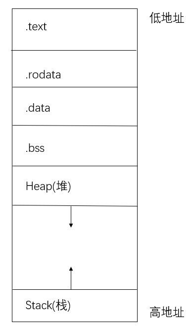

### 内存布局，链接脚本，入口点

一般来说，一个程序按照功能不同会分为下面这些段：

.text 段，即代码段，存放汇编代码；
.rodata 段，即只读数据段，顾名思义里面存放只读数据，通常是程序中的常量；
.data 段，存放被初始化的可读写数据，通常保存程序中的全局变量；
.bss 段，存放被初始化为 00 的可读写数据，与 .data 段的不同之处在于我们知道它要被初始化为 00 ，因此在可执行文件中只需记录这个段的大小以及所在位置即可，而不用记录里面的数据。
stack ，即栈，用来存储程序运行过程中的局部变量，以及负责函数调用时的各种机制。它从高地址向低地址增长；
heap ，即堆，用来支持程序运行过程中内存的动态分配，比如说你要读进来一个字符串，在你写程序的时候你也不知道它的长度究竟为多少，于是你只能在运行过程中，知道了字符串的长度之后，再在堆中给这个字符串分配内存。
内存布局，也就是指这些段各自所放的位置。一种典型的内存布局如下：



gnu工具链中，包含一个链接器`ld`

如果你很好奇，可以看[linker script的详细语法](http://www.scoberlin.de/content/media/http/informatik/gcc_docs/ld_3.html)

链接器的作用是把输入文件(往往是 .o文件)链接成输出文件(往往是elf文件)。一般来说，输入文件和输出文件都有很多section, 链接脚本(linker script)的作用，就是描述怎样把输入文件的section映射到输出文件的section, 同时规定这些section的内存布局。

如果你不提供链接脚本，ld会使用默认的一个链接脚本，这个默认的链接脚本适合链接出一个能在现有操作系统下运行的应用程序，但是并不适合链接一个操作系统内核。你可以通过`ld --verbose`来查看默认的链接脚本。

下面给出我们使用的链接脚本

```cpp
/* tools/kernel.ld */

OUTPUT_ARCH(riscv) /* 指定输出文件的指令集架构, 在riscv平台上运行 */
ENTRY(kern_entry)  /* 指定程序的入口点, 是一个叫做kern_entry的符号。我们之后会在汇编代码里定义它*/

BASE_ADDRESS = 0x80200000;/*定义了一个变量BASE_ADDRESS并初始化 */

/*链接脚本剩余的部分是一整条SECTIONS指令，用来指定输出文件的所有SECTION
 "." 是SECTIONS指令内的一个特殊变量/计数器，对应内存里的一个地址。*/
SECTIONS
{
    /* Load the kernel at this address: "." means the current address */
    . = BASE_ADDRESS;/*对 "."进行赋值*/
	/* 下面一句的意思是：从.的当前值（当前地址）开始放置一个叫做text的section. 
	 花括号内部的*(.text.kern_entry .text .stub .text.* .gnu.linkonce.t.*)是正则表达式
	 如果输入文件中有一个section的名称符合花括号内部的格式
	 那么这个section就被加到输出文件的text这个section里
	 输入文件中section的名称,有些是编译器自动生成的,有些是我们自己定义的*/
    .text : {
        *(.text.kern_entry) /*把输入中kern_entry这一段放到输出中text的开头*/
        *(.text .stub .text.* .gnu.linkonce.t.*)
    }

    PROVIDE(etext = .); /* Define the 'etext' symbol to this value */
	/*read only data, 只读数据，如程序里的常量*/
    .rodata : {
        *(.rodata .rodata.* .gnu.linkonce.r.*)
    }

    /* 进行地址对齐，将 "."增加到 2的0x1000次方的整数倍，也就是下一个内存页的起始处 */
    . = ALIGN(0x1000);

  	
    .data : {
        *(.data)
        *(.data.*)
    }
	/* small data section, 存储字节数小于某个标准的变量，一般是char, short等类型的 */
    .sdata : {
        *(.sdata)
        *(.sdata.*)
    }

    PROVIDE(edata = .);
	/* 初始化为零的数据 */
    .bss : {
        *(.bss)
        *(.bss.*)
        *(.sbss*)
    }

    PROVIDE(end = .);
	/* /DISCARD/表示忽略，输入文件里 *(.eh_frame .note.GNU-stack)这些section都被忽略，不会加入到输出文件中 */
    /DISCARD/ : {
        *(.eh_frame .note.GNU-stack)
    }
}
```

> 趣闻 
>
> 为什么把初始化为0（或者说，无需初始化）的数据段称作bss?
>
> CSAPP 7.4 Relocatable Object files
>
> Aside Why is uninitialized data called .bss?
> The use of the term .bss to denote uninitialized data is universal. It was originally an acronym for the
> “block started by symbol” directive from the IBM 704 assembly language (circa 1957) and the acronym
> has stuck. A simple way to remember the difference between the .data and .bss sections is to think
> of “bss” as an abbreviation for “Better Save Space!”

我们在链接脚本里把程序的入口点定义为`kern_entry`, 那么我们的程序里需要有一个名称为`kern_entry`的符号。我们在`kern/init/entry.S`编写一段汇编代码, 作为整个内核的入口点。

```asm
# kern/init/entry.S
#include <mmu.h>
#include <memlayout.h>

# The ,"ax",@progbits tells the assembler that the section is allocatable ("a"), executable ("x") and contains data ("@progbits").
# 从这里开始.text 这个section, "ax" 和 %progbits描述这个section的特征
# https://www.nongnu.org/avr-libc/user-manual/mem_sections.html
.section .text,"ax",%progbits 
    .globl kern_entry # 使得ld能够看到kern_entry这个符号所在的位置, globl和global同义
    # https://sourceware.org/binutils/docs/as/Global.html#Global
kern_entry: 
    la sp, bootstacktop 
    tail kern_init 
#开始data section
.section .data
    .align PGSHIFT #按照2^PGSHIFT进行地址对齐, 也就是对齐到下一页 PGSHIFT在 mmu.h定义
    .global bootstack #内核栈
bootstack:
    .space KSTACKSIZE #留出KSTACKSIZE这么多个字节的内存
    .global bootstacktop #之后内核栈将要从高地址向低地址增长, 初始时的内核栈为空
bootstacktop:                              
```

现在这个入口点，作用就是分配好内核栈，然后跳转到`kern_init`, 看来这个`kern_init`才是我们真正的入口点。下面我们就来看看它。
