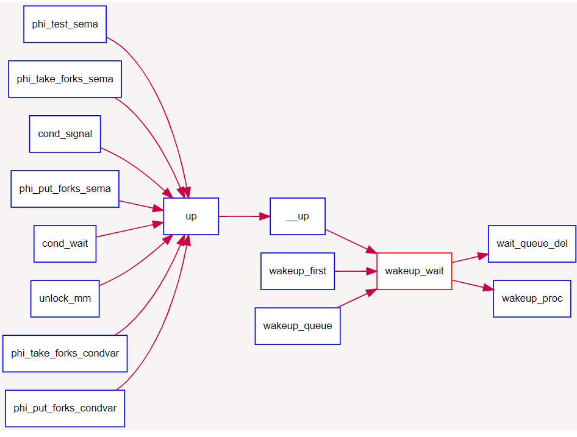
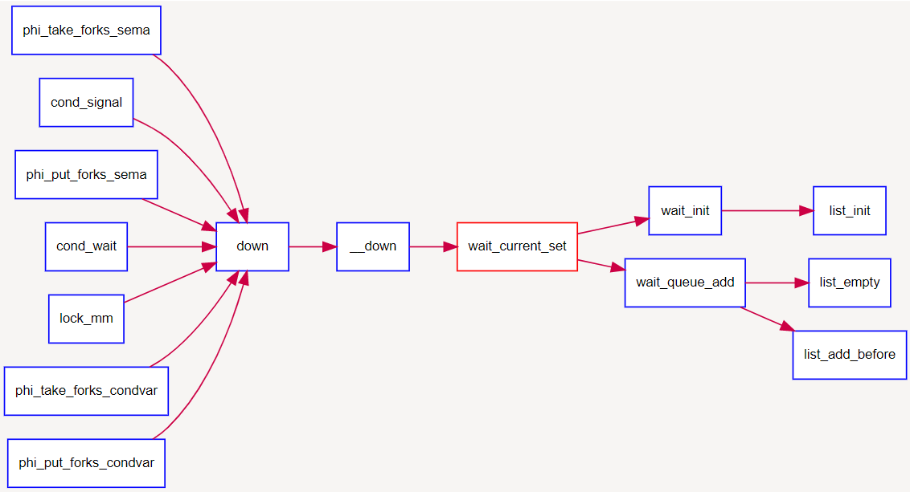

## 同步互斥的一些基本概念

虽然我们经常把同步和互斥放在一起说，但是这两个词是两个概念。**同步**指的是进程间的执行需要按照某种先后顺序，即访问是有序的。**互斥**指的是对于某些共享资源的访问不能同时进行，同一时间只能有一定数量的进程进行。这两种情况基本构成了我们在多线程执行中遇到的各种问题。

与同步互斥相关的另一个概念是**临界区**。临界区指的是进程的一段代码，其特征要求了同一时间段只能有一个进程执行，否则就有可能出现问题。一般而言，进程处理临界区的思路是设计一个协议，不同的进程遵守这个相同的协议来进行临界区的协调。在进入临界区前，进程请求进入的许可，这段代码称为**进入区**；退出临界区时，进程应该通过协议告知别的进程自己已经使用完临界区，这段代码称为**退出区**；临界区其他的部分称为**剩余区**。我们本章解决的问题，就是在进入区和退出区为进程提供同步互斥的机制。

为了提供同步互斥机制，操作系统有多种实现方法，包括时钟中断管理，屏蔽使能中断，等待队列，信号量，管程等等。下面我们来分别看一看上面提到的部分机制：

### 时钟中断管理

在lab1中我们已经实现了时钟中断。在ucore 中，时钟（timer）中断给操作系统提供了有一定间隔的时间事件，操作系统将其作为基本的调度和计时单位（我们记两次时间中断之间的时间间隔为一个时间片，timer splice）。

通过时钟中断，操作系统可以提供基于时间节点的事件。通过时钟中断，操作系统可以提供任意长度的等待唤醒机制，由此可以给应用程序机会来实现更加复杂的自定义调度操作。

* `sched.h`, `sched.c` 定义了有关timer的各种相关接口来使用 timer 服务，其中主要包括:
* `typedef struct {……} timer_t`: 定义了 timer\_t 的基本结构，其可以用 `sched.h` 中的`timer_init`函数对其进行初始化。
* `void timer_init(timer t *timer, struct proc_struct *proc, int expires)`: 对某timer进行初始化，让它在 expires 时间片之后唤醒 proc进程。
* `void add_timer(timer t *timer)`: 向系统添加某个初始化过的timer\_t，该timer在指定时间后被激活，并将对应的进程唤醒至runnable（如果当前进程处在等待状态）。
* `void del_timer(timer_t *time)`: 向系统删除（或者说取消）某一个timer。该timer在取消后不会被系统激活并唤醒进程。
* `void run_timer_list(void)`: 更新当前系统时间点，遍历当前所有处在系统管理内的timer，找出所有应该激活的计数器，并激活它们。该过程在且只在每次时钟中断时被调用。在ucore中，其还会调用调度器事件处理程序。

一个 timer\_t 在系统中的存活周期可以被描述如下：

1. timer\_t 在某个位置被创建和初始化，并通过add\_timer加入系统管理列表中。
2. 系统时间被不断累加，直到 run\_timer\_list 发现该 timer\_t到期。
3. run\_timer\_list更改对应的进程状态，并从系统管理列表中移除该timer\_t。

尽管本次实验并不需要填充时钟相关的代码，但是作为系统重要的组件，你应该了解其相关机制和在ucore中的实现方法和使用方法。且在trap_dispatch函数中修改之前对时钟中断的处理，使得ucore能够利用时钟提供的功能完成调度和睡眠唤醒等操作。

### 屏蔽使能中断

这部分主要是处理内核内的同步互斥问题。因为内核在执行的过程中可能会被外部的中断打断，我们实现的ucore也是不可抢占的系统，所以可以在操作系统进行某些需要同步互斥的操作的时候先禁用中断，等执行完之后再使能。这样保证了操作系统在执行临界区的时候不会被打断，也就实现了同步互斥。

根据操作系统原理的知识，我们知道如果没有在硬件级保证读内存-修改值-写回内存的原子性，我们只能通过复杂的软件来实现同步互斥操作。但由于有开关中断和test\_and\_set\_bit等原子操作机器指令的存在，使得我们在实现同步互斥原语上可以大大简化。

在ucore中提供的底层机制包括中断屏蔽/使能控制等。kern/sync.c中实现的开关中断的控制函数local\_intr\_save(x)和local\_intr\_restore(x)，它们是基于kern/driver文件下的intr\_enable()、intr\_disable()函数实现的。具体调用关系为：

```
关中断：local_intr_save --> __intr_save --> intr_disable --> cli
开中断：local_intr_restore--> __intr_restore --> intr_enable --> sti 
```

最终的cli和sti是x86的机器指令，最终实现了关（屏蔽）中断和开（使能）中断，即设置了eflags寄存器中与中断相关的位。通过关闭中断，可以防止对当前执行的控制流被其他中断事件处理所打断。既然不能中断，那也就意味着在内核运行的当前进程无法被打断或被重新调度，即实现了对临界区的互斥操作。所以在单处理器情况下，可以通过开关中断实现对临界区的互斥保护，需要互斥的临界区代码的一般写法为：

```C
local_intr_save(intr_flag);
{
  临界区代码
}
local_intr_restore(intr_flag);
……
```

由于目前ucore只实现了对单处理器的支持，所以通过这种方式，就可简单地支撑互斥操作了。在多处理器情况下，这种方法是无法实现互斥的，因为屏蔽了一个CPU的中断，只能阻止本地CPU上的进程不会被中断或调度，并不意味着其他CPU上执行的进程不能执行临界区的代码。所以，开关中断只对单处理器下的互斥操作起作用。在本实验中，开关中断机制是实现信号量等高层同步互斥原语的底层支撑基础之一。

### 等待队列：

等待队列是操作系统提供的一种事件机制。一些进程可能会在执行的过程中等待某些特定事件的发生，这个时候进程进入睡眠状态。操作系统维护一个等待队列，把这个进程放进他等待的事件的等待队列中。当对应的事件发生之后，操作系统就唤醒相应等待队列中的进程。这也是ucore内部实现信号量的机制。

内核实现这一功能的一个底层支撑机制就是等待队列`wait_queue`，等待队列和每一个事件（睡眠结束、时钟到达、任务完成、资源可用等）联系起来。需要等待事件的进程在转入休眠状态后插入到等待队列中。当事件发生之后，内核遍历相应等待队列，唤醒休眠的用户进程或内核线程，并设置其状态为就绪状态（PROC_RUNNABLE），并将该进程从等待队列中清除。ucore在`kern/sync/{ wait.h, wait.c}`中实现了等待项wait结构和等待队列`wait_queue`结构以及相关函数），这是实现ucore中的信号量机制和条件变量机制的基础，进入wait
queue的进程会被设为等待状态（PROC_SLEEPING），直到他们被唤醒。

####　数据结构定义
```C
typedef  struct {
    struct proc_struct *proc;     //等待进程的指针
    uint32_t wakeup_flags;        //进程被放入等待队列的原因标记
    wait_queue_t *wait_queue;     //指向此wait结构所属于的wait_queue
    list_entry_t wait_link;       //用来组织wait_queue中wait节点的连接
} wait_t;

typedef struct {
    list_entry_t wait_head;       //wait_queue的队头
} wait_queue_t;

le2wait(le, member)               //实现wait_t中成员的指针向wait_t 指针的转化
```

####　相关函数说明
与wait和wait queue相关的函数主要分为两层，底层函数是对wait queue的初始化、插入、删除和查找操作，相关函数如下：

```C
void wait_init(wait_t *wait, struct proc_struct *proc);    //初始化wait结构
bool wait_in_queue(wait_t *wait);                          //wait是否在wait queue中
void wait_queue_init(wait_queue_t *queue);                 //初始化wait_queue结构
void wait_queue_add(wait_queue_t *queue, wait_t *wait);    //把wait前插到wait queue中
void wait_queue_del(wait_queue_t *queue, wait_t *wait);    //从wait queue中删除wait
wait_t *wait_queue_next(wait_queue_t *queue, wait_t *wait);//取得wait的后一个链接指针
wait_t *wait_queue_prev(wait_queue_t *queue, wait_t *wait);//取得wait的前一个链接指针
wait_t *wait_queue_first(wait_queue_t *queue);             //取得wait queue的第一个wait
wait_t *wait_queue_last(wait_queue_t *queue);              //取得wait queue的最后一个wait
bool wait_queue_empty(wait_queue_t *queue);                //wait queue是否为空
```

高层函数基于底层函数实现了让进程进入等待队列`wait_current_set`，以及从等待队列中唤醒进程`wakeup_wait`，相关函数如下：

```C
//让wait与进程关联，且让当前进程关联的wait进入等待队列queue，当前进程睡眠
void wait_current_set(wait_queue_t *queue, wait_t *wait, uint32_t wait_state);
//把与当前进程关联的wait从等待队列queue中删除
wait_current_del(queue, wait);
//唤醒与wait关联的进程
void wakeup_wait(wait_queue_t *queue, wait_t *wait, uint32_t wakeup_flags, bool del);
//唤醒等待队列上挂着的第一个wait所关联的进程
void wakeup_first(wait_queue_t *queue, uint32_t wakeup_flags, bool del);
//唤醒等待队列上所有的等待的进程
void wakeup_queue(wait_queue_t *queue, uint32_t wakeup_flags, bool del);
```

#### 调用关系举例

如下图所示，对于唤醒进程的函数`wakeup_wait`，可以看到它会被各种信号量的V操作函数`up`调用，并且它会调用`wait_queue_del`函数和`wakup_proc`函数来完成唤醒进程的操作。



如下图所示，而对于让进程进入等待状态的函数`wait_current_set`，可以看到它会被各种信号量的P操作函数`down`调用，并且它会调用`wait_init`完成对等待项的初始化，并进一步调用`wait_queue_add`来把与要处于等待状态的进程所关联的等待项挂到与信号量绑定的等待队列中。


接下来的两节，我们来仔细看一看信号量和管程的实现。